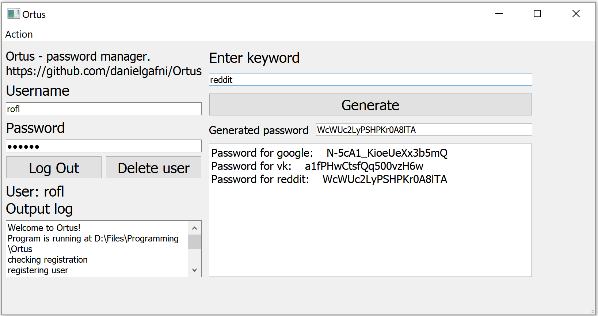

# Ortus

This is my password manager.

Done:

- Cross-platform application
- Users system
- Password managing
- All user data is stored encrypted

TODO:

- Web interface
- Automatic updates
- Cloud data storage
- Clean mode - not saving any data

# Installation

1. Clone or download Ortus

2. Install [Python 3](https://www.python.org/downloads/). **<u>!!! Select "add python to path" option when installing !!!</u>**

3. Open console

4. Navigate to Ortus directory:

   ​	cd "your_path_to_Ortus"

5. Install required modules:

   ​	pip install -r requirements.txt

6. Done!

# Usage

Run scripts/OrtusApp.py